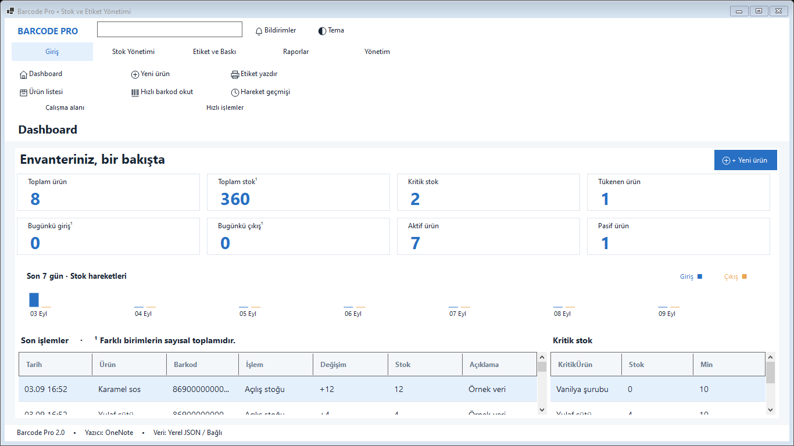
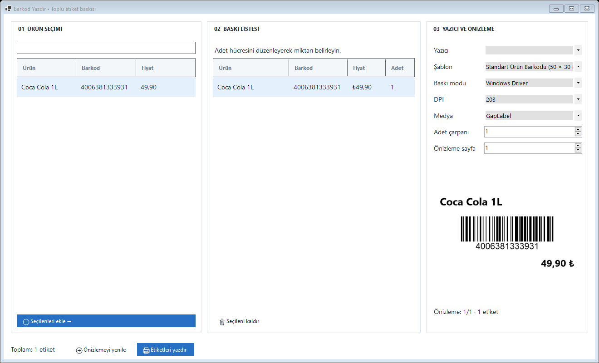
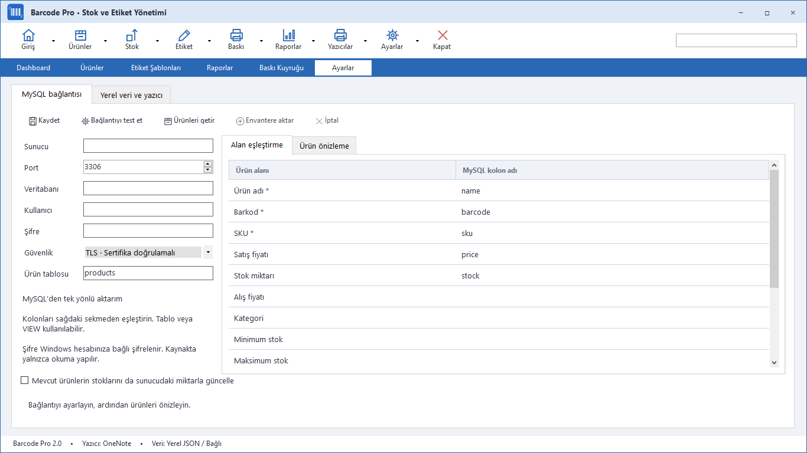

# R3 M-Kobi

R3 M-Kobi is a compact Windows inventory, barcode and label management system for small and medium businesses. It provides DevExpress-inspired top navigation, aligned data grids, SQLite storage, centralized Server/Client mode, SQL product import and direct TSC/TTP label printing.

## Editions

- **Server** — Windows service with a central SQLite database, LAN API, firewall setup and administration screens.
- **Client** — connects to the Server over the local network and synchronizes product, stock and print operations.
- **Local** — uses a local SQLite database when a central Server is not required.

The first application login is `owner` / `owner`. Server and Client installations require a valid R3 license file. The license generator is intentionally built and kept locally; it is not uploaded to GitHub.

## Main features

- Dashboard metrics, recent movements and critical-stock views.
- Product CRUD with barcode/SKU uniqueness checks and image storage.
- Stock in, stock out, return, waste and audited stock correction operations.
- SQL import from `products` INSERT exports, with preview, field preservation and optional image loading.
- TSC TTP-244CE direct TSPL output, Code 39 Full ASCII, 0.50 mm X dimension and Windows-1252 support.
- Compact gray controls, transparent matte-gray R3 mark, icon-based caption buttons and context menus.





## Build

Requirements: Windows 10 1809 or later, .NET 8 SDK and Inno Setup 6.7+.

```powershell
dotnet build BarcodePrinter.slnx -c Release
dotnet run --project BarcodePrinter.Checks -c Release --no-build
.\installer\Build-Setup.ps1 -SkipChecks
```

Setup files are created under `artifacts/installer`. Public packages contain no customer inventory.

## Local license generator

Build the private generator locally. It writes a random six-digit license number and an expiry date to `license.json`.

```powershell
.\installer\Build-LicenseGenerator.ps1
& .\artifacts\local-license-generator\R3LicenseGenerator.exe 365 .\artifacts\local-license-generator\license.json
# Unlimited license:
& .\artifacts\local-license-generator\R3LicenseGenerator.exe unlimited .\artifacts\local-license-generator\license-unlimited.json
```

Give the generated `license.json` to the customer. At first launch, select the file and enter the displayed six-digit number. The Server stores its license in `%PROGRAMDATA%\R3-M-Kobi\license.json`; the Client stores it in `%LOCALAPPDATA%\R3-M-Kobi\license.json`. An expired license blocks the application and the Server service.

## Server and Client

Install Server on the host computer and Client on other computers. The Server service listens on TCP 5088 and discovery uses UDP 5089. The administration screen shows the local address, external address and access key. Full setup and SQL import instructions are in [SERVER-CLIENT.md](docs/SERVER-CLIENT.md).

## License

R3 M-Kobi is proprietary software. See [LICENSE](LICENSE). Third-party components retain their own licenses under `installer/licenses`.
