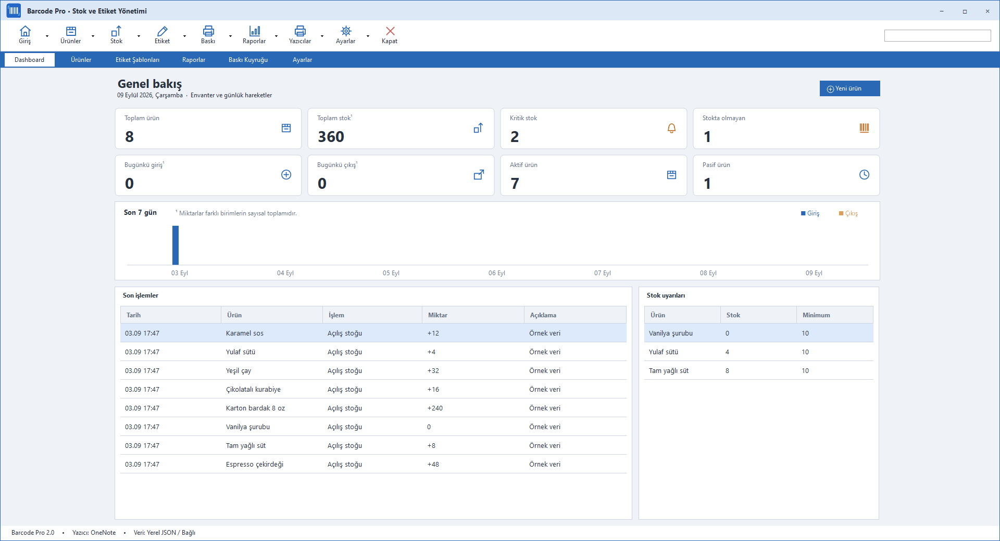

# Barcode Pro 2.1 Beta 1

Windows için stok yönetimi, MySQL ürün aktarımı ve TSC etiket baskısı uygulaması.

## Beta kurulumu

Setup.exe GitHub Releases bölümünde yayımlanır. Windows 10 (1809+) / Windows 11 64 bit desteklenir; kurulum .NET çalışma zamanını içerir. İlk giriş **owner / owner**; bu beta sürümünde sabittir.

- **Ayarlar → MySQL bağlantısı:** sunucu ve kolon eşleştirme, bağlantı testi, önizleme ve tek yönlü aktarım. [Bağlantı kılavuzu](docs/MYSQL-CONNECTION.md).
- **Ayarlar → Firma ve etiket:** firma adı/logo ve 60 × 40 mm, 203 DPI TTP-244CE şablonu.
- Kurulum dosyası imzasızdır. Canlı müşteri MySQL bağlantısı ve fiziksel yazıcı çıktısı ayrıca doğrulanmalıdır.
- 135 otomatik kontrol; kurulum/kaldırma ve 467 yayın dosyasının bütünlüğü doğrulandı.



## Setup üretimi

Windows, .NET SDK (slnx destekli) ve Inno Setup 6.7+ gerekir:

```powershell
./installer/Build-Setup.ps1 -Compiler 'C:\Program Files (x86)\Inno Setup 6\ISCC.exe'
./installer/Test-Setup.ps1
```

Çıktı: `artifacts/installer/BarcodePro-2.1.0-beta.1-Setup-x64.exe`. SHA256 dosyası aynı dizindedir. Kaynak depoya envanter, bağlantı şifreleri, derleme çıktıları ve yerel yedekler alınmaz.

Mevcut .NET 8 / Windows Forms stok uygulamasının üzerine eklenen barkod tasarım ve baskı çalışma alanı. Ücretli UI paketi kullanılmaz. Barkod üretimi için Apache-2.0 lisanslı ZXing.Net 0.16.11 kullanılır.

## Çalıştırma ve doğrulama

```powershell
dotnet build BarcodePrinter.slnx
dotnet run --project BarcodePrinter.Checks
dotnet run --project BarcodePrinter
```

Windows 10/11 ve .NET 8 Desktop Runtime gerekir. `ApplicationHighDpiMode=PerMonitorV2` açıktır. Çözüm hem uygulamayı hem Checks projesini içerir. NuGet.Config, nuget.org kaynağını proje kapsamında tanımlar.

## Stok yönetimi

Dashboard, arama/filtreleme/sıralama ve 75 satırlık sayfalama sunan ürün tablosu, kolon görünürlüğü, çoklu seçim, sağ tık işlemleri, stok hareketleri, menü/aktif durumları, kategori raporu ve CSV dışa aktarımı korunur. Görsel, eski fiyat ve güncelleme bilgisi ürün ekranında bulunur.

Negatif stok, yinelenen barkod/SKU ve pasif ürüne stok hareketi engellenir. Stok düzeltme **yeni toplam miktarı** belirler ve açıklama gerektirir. Fire için de açıklama gerekir. Ürün düzenleme stok hareketi oluşturmanın yerine geçmez. Yalnızca stoğu sıfır ürün silinebilir; geçmiş hareketler tutulur. Maksimum stok bir planlama eşiğidir, giriş engeli değildir.

## Etiket tasarımı

1. **Etiket Şablonları → Hazır şablonları ekle** ile TTP-244CE dahil sekiz başlangıç tasarımı oluşturun veya **Etiket Tasarım Stüdyosu** açın.
2. **Etiket ayarları** ile isim, mm boyutu, DPI, medya, kenar boşlukları, satır/sütun ve aralıkları düzenleyin. Boyut seçicisi 11 hazır ölçü sunar; özel ölçüler özellik panelinden girilir.
3. Araçları tıklayarak veya kağıda sürükleyerek ekleyin. Nesneyi sürükleyerek taşıyın; sağ alt tutamacından boyutlandırın. Sağ panel konum, boyut, döndürme, görünürlük ve nesneye özgü ayarları düzenler.
4. Metin, barkod, QR, görsel/logo, çizgi, dikdörtgen ve tam/kuruş ayrı fontlu büyük fiyat öğeleri desteklenir. Görseller şablon JSON'una gömülür; başka bilgisayara aktarımda ayrıca görsel dosyası gerekmez.
5. Kaydet, Farklı kaydet; şablon ekranında Kopyala, Sil, İçe/Dışa aktar bulunur. 1,6 saniye hareketsizlikten sonra ayrı taslak kaydedilir. Kaydedilmemiş yeni tasarımlar da **Taslak kurtar** ile bulunabilir.

Kısayollar: Delete, Ctrl+C/V/D, Ctrl+Z/Y/A/S; yön tuşları 0,1 mm, Shift+yön 5 mm. Metin/özellik editöründeyken standart metin kısayolları korunur. Geri alma geçmişi 60 adım saklar. Hareket sırasında diske kayıt yapılmaz.

Dinamik alanlar: `{{ProductName}}`, `{{Barcode}}`, `{{SKU}}`, `{{Price}}`, `{{OldPrice}}`, `{{Category}}`, `{{Unit}}`, `{{Description}}`, `{{Stock}}`, `{{Date}}`, `{{Time}}`. Bilinmeyen alan baskıyı durdurur. Fiyat biçimleri sembol başta/sonda, noktalı TL ve virgüllü TL'dir. Eski fiyat, ürün formunda 0 girildiğinde boş tutulur.

EAN-13, EAN-8, Code 128, Code 39, UPC-A, UPC-E, ITF, Codabar ve QR desteklenir. Baskıda seçilen türe göre doğrulanır; EAN kontrol basamağı gerçektir. Bu doğrulama eski stok dosyasının yüklenmesini engellemez. Barkod alanı gerekli modül genişliğine sığmıyorsa baskı başlamadan hata verilir.

## Yazıcı ve toplu baskı

**Yazıcılar** Windows kurulu yazıcılarını, sürücü/port/default/kağıt ve mevcutsa DPI/durum bilgilerini listeler. Bunlar Windows'un bildirimidir; donanımın anlık sensör durumu garanti edilmez.

Bir yazıcı seçin; sağ panelde **Dpi**, **Mode** ve açılabilir **Calibration** alanlarını ayarlayıp profili kaydedin. Desteklenen DPI: 203, 300, 600. Ayarlar → Yazıcı ayarları ve kalibrasyon aynı ekranı açar.

- **WindowsDriver:** PrintDocument, özel sayfa boyutu ve sürücünün sert kenar boşluğu telafisi kullanılır. Sürücü gerçek kağıt boyutunu ve çözünürlüğü desteklemelidir. PDF gibi sanal yazıcılar kendi dosya diyaloglarını açabilir.
- **RawTspl:** Yalnızca TSPL/TSPL2 uyumlu yazıcılarda seçin. TSC adı/sürücüsü algılandığında bilgi gösterilir. Başka bir dile ayarlı yazıcıda kullanmayın.

**Barkod Yazdır** ekranında arayın/okutun, ürünleri sepete ekleyin, her ürünün adedini değiştirin. Adet çarpanı tüm satırlara uygulanır. Yazıcı, şablon, DPI ve medya seçin. Önizleme sayfası çok sütunlu/satırlı düzeni ve seçili sayfanın gerçek ürünlerini gösterir. Tek işte en fazla 10.000 etiket, RAW veri üretiminde 100 MB sınırı vardır. Büyük raster sayfalar için 40 milyon piksel sınırı uygulanır.

**Baskı Kuyruğu** Queued / Printing / Completed / Failed durumlarını, hata ayrıntısını ve tekrar yazdırmayı sunar. Completed, Windows spooler'a teslim anlamındadır; fiziksel çıktı doğrulaması değildir. Uygulama kapanırken sürmekte olan iş açılışta belirsiz/başarısız olarak işaretlenir ve otomatik yeniden basılmaz. Başarısız işte kısmi çıktı olabileceği için tekrar basmadan mevcut etiketleri kontrol edin.

## Ölçü ve renderer

Tek kaynak `LabelTemplate` modelidir. Tüm ölçüler double mm saklanır; `dots = mm × DPI / 25.4`. Yuvarlama yalnızca son raster/dot sınırında yapılır.

Designer, önizleme, Windows driver ve TSPL aynı `LabelPreviewRenderer` çizimini paylaşır. TSPL renderer, Türkçe/özel fontlar ve WYSIWYG için monokrom **BITMAP** kullanır. Ayrı `TsplCommandBuilder` ayrıca SIZE, GAP, BLINE, DIRECTION, REFERENCE, CLS, TEXT, BARCODE, QRCODE, BOX, BAR ve PRINT üretir. TSPL'de yatay çizgi komutu BAR'dır; olmayan bir LINE komutu gönderilmez. Native metin komutları güvenli ASCII ile sınırlandırılır; Türkçe raster olarak basılır.

Windows spooler çağrıları SafeHandle, tam yazım kontrolü ve hata halinde AbortPrinter ile merkezileştirilmiştir. Baskı ve yazıcı keşfi UI iş parçacığını bloklamaz.

## Donanım kabul testi

Fiziksel TSC cihazında baskı bu geliştirme ortamında denenmedi. Sürümün iş yerine alınmasından önce:

1. Yazıcının gerçek DPI ve medya/sensör ayarlarını doğrulayın.
2. **Kalibrasyon test etiketi** ile 50×30 mm etiketi, 10 mm çizgiyi ve merkez/sınırları basın.
3. Cetvelle ölçün; gerekirse yazıcı bazında X/Y ofset ve yatay/dikey ölçek ayarlayın. Ofset ±20 mm, ölçek 0,8–1,2 aralığındadır.
4. Barkodu gerçek okuyucuyla okuyun; Türkçe font, dönüş, gap/black mark, toplu sayfa geçişi ve yeniden baskıyı deneyin.
5. Windows 10/11 üzerinde gerçek 125/150/175/200% monitör ölçeklemelerinde ekranları kontrol edin. PerMonitorV2 yapılandırıldı; her fiziksel monitör kombinasyonu burada test edilmedi.

## Veri konumları ve uyumluluk

`%LOCALAPPDATA%\BarcodePro\` altında:

- `inventory.json` ve `.bak`: mevcut stok verisi, atomik kayıt korunur. Yeni isteğe bağlı `OldPrice` ve hareket barkod kopyası alanları eski dosyalarda varsayılan değerlerle açılır; migration gerekmez.
- `images/`: ürün görselleri.
- `templates/`: GUID adlarıyla JSON şablonlar, `.draft.json` taslaklar ve `.bak` yedekler.
- `printers.json`: yazıcı profilleri ve kalibrasyon.
- `print-queue.json`: baskı geçmişi ve iş anındaki ürün/şablon kopyaları.
- `logs/`: teknik hata ayrıntıları.

Tam yedek için uygulama kapalıyken klasörün tamamını kopyalayın. Ayarlardaki stok JSON dışa aktarımı tek başına ürün görsellerini veya şablonları içermez. Aynı Windows oturumunda ikinci uygulama örneği engellenir. Ağ üzerinden çok kullanıcı, mobil arayüz ve kamera taraması bu masaüstü kapsamına dahil değildir.

## Kaynak ve geliştirme kaydı

Faz bazında dosyalar, doğrulama ve sınırlar: [docs/DEVELOPMENT.md](docs/DEVELOPMENT.md).
TSPL sözdizimi [TSC TSPL/TSPL2 3.0 kılavuzuna](https://fs.tscprinters.com/system/files/31-0000001-00_tspl_tspl2_programming_3_0.pdf), barkod kodlayıcı [ZXing.Net projesine](https://github.com/micjahn/ZXing.Net) dayanır.

## Güncel menü düzeni

Referans ERP ekranına uygun olarak geniş ribbon yerine tek sıra ikonlu modül menüsü kullanılır. **Giriş / Ürünler / Stok / Etiket / Baskı / Raporlar / Yazıcılar / Ayarlar** başlıklarına basınca ilgili alt işlemler açılır. Hemen altındaki mavi şeritte açılan ekranlar arasında geçiş yapılır. Dashboard kartları ve Yeni ürün düğmesi pencere büyütüldüğünde gereksiz yere uzamaz.

